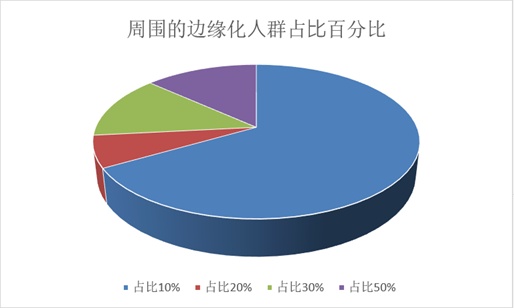
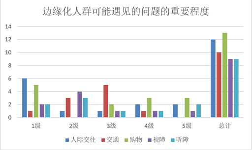
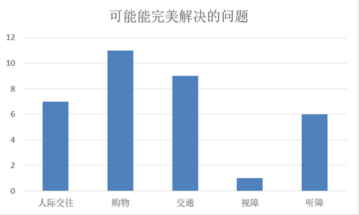
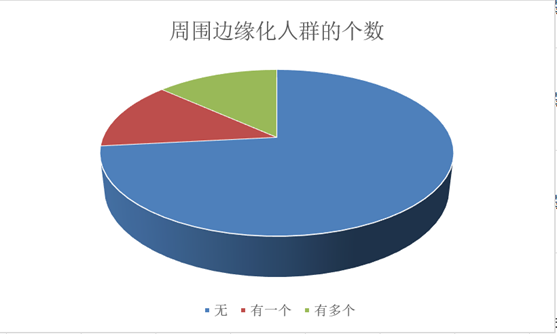
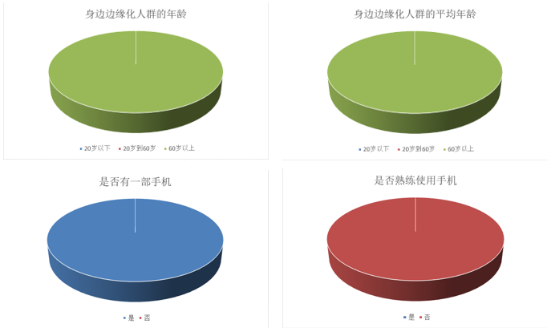
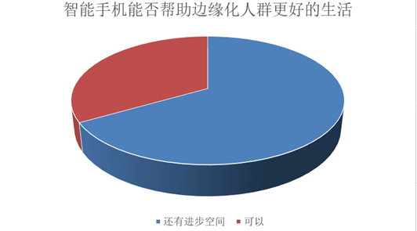
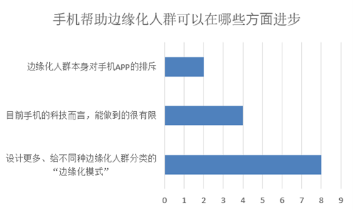
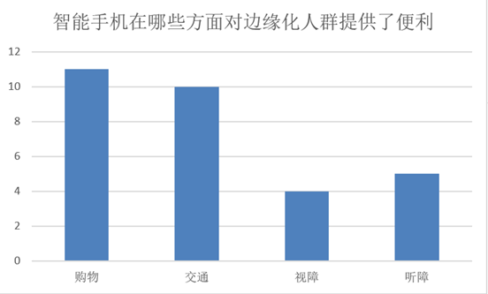
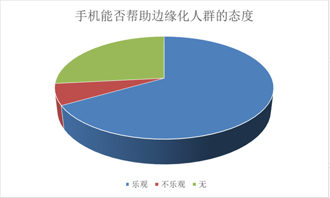

可视化分析问卷调查结果。

## 调查分析

1. 调查发现周围边缘化人群占比大多是10%，只有少数占比20%，30%，50%。

   

2. 大部分人认为边缘化人群遇见的问题最重要的是人际交往问题，其次是购物问题，接下来是交通。视障与听障问题相差不大。

   

3. 基于上述边缘化人群可能遇见的问题，大部分人认为智能手机APP可以完美解决的问题是购物问题，其次是交通和人际交往问题。

   

4. 调查人员身边边缘化人群的个数大多是没有，只有少数有一个或是多个。

   

5. 身边有边缘化人群的年龄及平均年龄都是60岁以上，而且都拥有一部手机，不熟练使用手机。

   

6. 一半以上的人认为智能手机帮助边缘化人群更好的生活方面比较勉强，还有进步空间。

   

7. 大部分人认为手机帮助边缘化人群可以在设计不同模式方面取得进步，少部分人认为目前的科技来说能做到的有限。

   

8. 大部分人认为智能手机在购物和交通方面提供了很大的便利，在视障和听障方面较少。

   

9. 对于智能手机能否帮助边缘化人群大部分人是持有乐观态度的。

   

   

## 总结

本次问卷调查旨在深入了解边缘化人群遇到的困难、常见的解决方式，以及从普通人群的角度出发了解边缘化人群提高生活质量的方式。通过调查问卷了解了调查对象周边的残疾人比例、调查对象认为边缘化人群面临最大的问题、边缘化人群的年龄情况和智能手机使用情况、对智能手机APP帮助边缘化人群的态度和了解程度等方面的情况。

大部分认为边缘化人群面临的问题最重要的是人际交往问题，其次是购物和交通问题，而大部分人认为智能手机能解决的问题首先是购物问题，其次是交通和人际交往问题，目前智能手机在交通和购物方面提供便利较多，在视障听障方面较少。现在的智能手机在帮助边缘化人群方面还比较勉强，还有进步空间，可以通过设计不同边缘化模式帮助不同的边缘化人群。

通过本次调查问卷我们可以发现：现在的智能手机在帮助边缘化人群方面还做的不够完善，要通过设计不同边缘化模式以帮助不同的边缘化人群解决问题、排除障碍、提高生活质量。令人较为惊讶的是所有被调查者身边的边缘化人群年龄均在60岁以上、均不能熟练使用智能手机。大部分被调查者对边缘化人群有一定了解，并对于通过智能手机APP来帮助边缘化人群持有较乐观态度。

